# New-York-City-Motor-Vehicles-Collisions-Data-Analytics

## Problem Statement

Developed and built a data engineering solution that could integrate, process, and load this dataset from the NYC Open Data portal and the NYPD website into a consolidated data warehouse so that data analysts and scientists can quickly access and study it. In order to handle growing data volumes and a variety of data kinds while maintaining data integrity and adhering to data protection laws, the solution must be scalable, resilient, and secure. This data engineering solution's overarching objective is to empower our organization to make data-driven decisions, enhance customer engagement, and foster business expansion. It is possible for the general public to access statistical data on auto accidents. The data is updated on a monthly basis, and grouped by borough intersections, bridges, and tunnels.

## Key Takeaways

Built a data engineering pipeline that included data extraction, data cleansing, transformation, exploratory analysis, data visualization, and data flow orchestration of event data on the cloud, I used data from the NYC Open Data portal and NYPD Public Data to analyze the automobile and traffic accidents occurring in New York City.

## Dataset

**New York City Traffic Data/Motor Vehicle Collisions** - The project uses a variety of data sources, such as Open Data from crashes, vehicles, and people, as described below. The same data source provides all of the datasets and the data on motor vehicle collisions.

- [Motor Vehicle Collisions - Crashes](https://data.cityofnewyork.us/Public-Safety/Motor-Vehicle-Collisions-Crashes/h9gi-nx95) - Details about the crash incident are available in the Motor Vehicle Collisions crash dataset. A crash occurrence is represented by each row. All police reports of motor vehicle collisions in NYC are included in the Motor Vehicle Collisions statistics. For collisions involving injuries, fatalities, or property damage totaling at least $1,000, a police report (MV104-AN) must be filed (https://www.nhtsa.gov/sites/nhtsa.dotgov/files/documents/ny_overlay_mv-104an_rev05_2004.pdf). It should be noted that the information is provisional and is subject to modification when the MV-104AN forms are updated in light of updated crash information.
  
- [Motor Vehicle Collisions - Vehicles](https://data.cityofnewyork.us/Public-Safety/Motor-Vehicle-Collisions-Vehicles/bm4k-52h4) - Each vehicle involved in the collision is described in the Motor Vehicle Collisions vehicle dataset. A motor vehicle engaged in a collision is represented by each row. When crash reporting transitioned to an electronic method in April 2016, the data in this dataset began to accumulate.

- [Motor Vehicle Collisions - Person](https://data.cityofnewyork.us/Public-Safety/Motor-Vehicle-Collisions-Person/f55k-p6yu) - The Motor Vehicle Collisions person dataset includes information on those who were in the accident. Each row represents a crash victim (driver, passenger, pedestrian, bicyclist, etc.). When crash reporting transitioned to an electronic system in April 2016, the data in this source began to accumulate.

## Data Description

This dataset consists of below metadata information:

|              Data Source             |   Rows   |   Columns   |  Update Frequency |   File Format  |
|:------------------------------------:|:--------:|:-----------:|:-----------------:|:--------------:|
|               Crashes                |   1.95M  |       29    |       Daily       |      csv       |
|               Vehicles               |   3.705M |       25    |       Daily       |      csv       |
|               Persons            	   |   4.90M  |       21    |       Daily       |      csv       |

## Tools 

Below tools have been utilized for the various segments involving Data Profiling, Modeling, Integration and BI Reporting and Visualizations:

# Data Modeling

This project utilizes ER/Studio Data Architect's potential for designing, illustrating, and overseeing data models and metadata within the database. ER/Studio has enabled the creation of conceptual, logical, and physical data models, facilitating the mapping of relationships and dependencies among them. The approach to data modeling has followed an iterative process involving design, reviews, feedback, and improvements, all aligned with the needs of the business and end-users.

  
   
	<a href="#">
        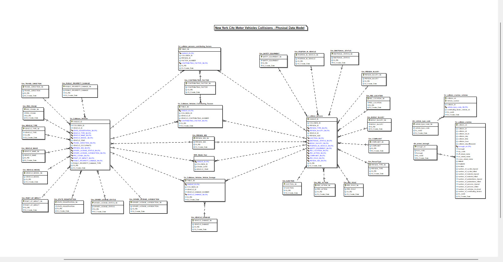 
  </a>		
     
	Dimensional Data Model - New York City Motor Vehicles Collisions

 

## Data Integration / ETL Pipeline

In this project, data is analysed, profiled, transformed and loaded into Microsoft SQL server by Talend and Alteryx. Data is collected from BigQuery and flat files (csv/tsv) and is moved to landing zones (Stage) in SQL Server.

The ETL process involved 2 layer of data landing, transformation and loading.
- **Landing or Staging Data Layer**: The data is extracted form source and staged into the SQL Server database. Here the main focus is to land the data from source with minimal transformation (as-is data load). Also, ETL Audit fields such as DI_PID, DI_Create_Date etc. were added to identify newly loaded or updated records by using audit columns.

	|              Schema                      |             Table  	   |
	|:----------------------------------------:|:-----------------------------:|
	|               NYC_MV                |    STG_NYC_MV_COLLISIONS_BIGQUERY  |
	|               NYC_MV                |    STG_NYC_MV_COLLISION_VEHICLES   |
	|               NYC_MV                |    STG_NYC_MV_COLLISION_PERSONS    |

**Data Worflow for Staging using Talend**

  
   
	<a href="#">
        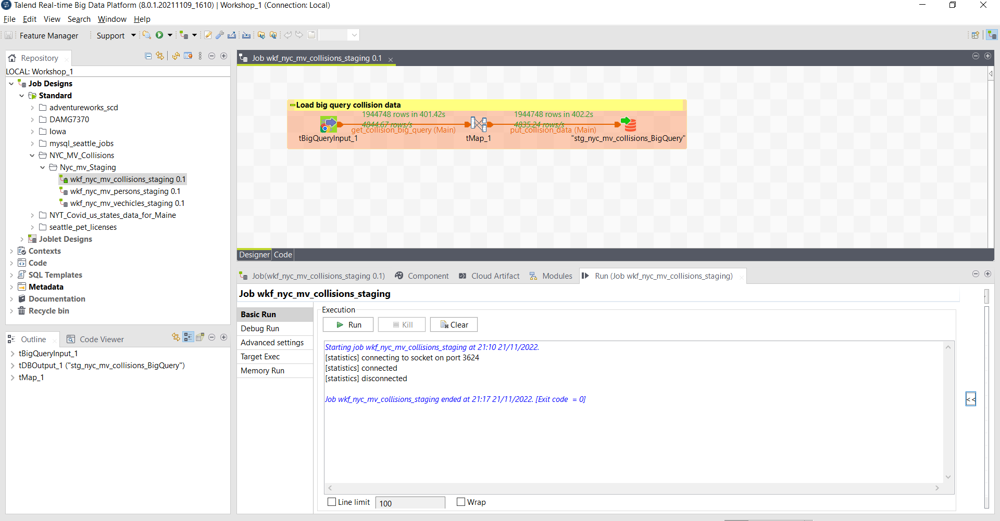 
  </a>		
     
	Collision Data using Bigquery

 

  
   
	<a href="#">
        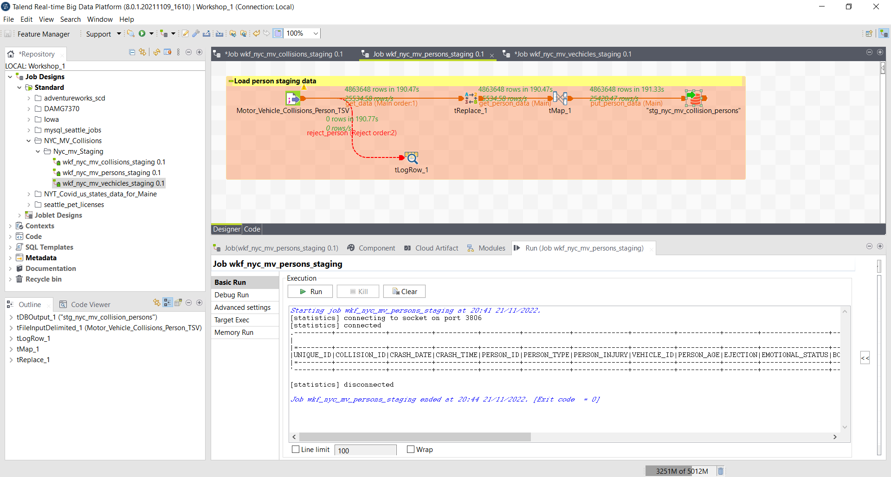 
  </a>		
     
	Person Data

 

  
   
	<a href="#">
        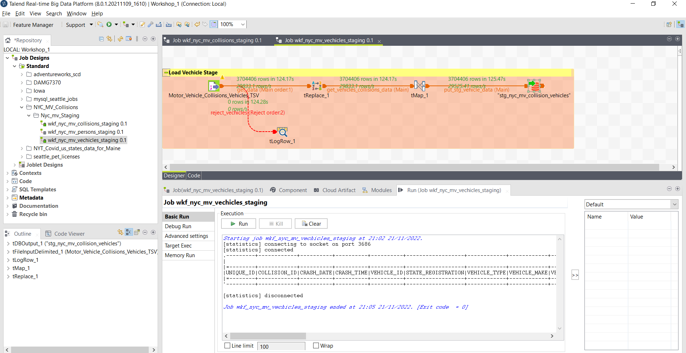 
  </a>		
     
	Vechile Data

 

- **Dimensional Data Layer**: Data is loaded to multi-fact dimensional data warehouse after performing extraction from Stage and transformation with defined rules and performed data quality checks post data load. I also addded DI attributes (audit columns) to each dimension and fact for record audit and maintenance. Also, below are few workflows to load some dimensions and facts tables.

	|              Schema                  |             Table  	   |
	|:------------------------------------:|:-------------------------:|
	|               NYC_MV                 |    Dim_vehicle_type_code  |
	|               NYC_MV                 |    fct_collision_persons  |
	|               NYC_MV                 |    fct_collision_crashes  |
	|               NYC_MV                 |    fct_Collisions_Vehicles  |
	|               NYC_MV                 |    fct_collision_crashes_vehicles  |
	|               NYC_MV                 |    fct_collision_persons_contributing_factors  |
	|               NYC_MV                 |    fct_Collisions_Vehicles_Contributing_Factors  |
	|               NYC_MV                 |    fct_Collisions_Vechicles_Contributing_Factors_Tnx  |
	|               NYC_MV                 |    fct_collision_persons_contributing_factors_Tnx  |
	|               NYC_MV                 |    fct_Collisions_Vehicles_Vehicle_Damage  |
	|               NYC_MV                 |    stg_nyc_mv_collision_vehicles  |
	|               NYC_MV                 |    ERR_Model_Year  |
	|               NYC_MV                 |    ERR_Person_Age  |
	|               NYC_MV                 |    stg_nyc_mv_collision_persons  |
	|               NYC_MV                 |    dim_arrest_borough  |
	|               NYC_MV                 |    fct_Collisions_Vehicles_Vehicle_Damage_Tnx  |
	|               NYC_MV                 |    Dim_COMPLAINT  |
	|               NYC_MV                 |    Dim_CONTRIBUTING_FACTOR  |
	|               NYC_MV                 |    Dim_DRIVER_LICENSE_JURISDICTION  |
	|               NYC_MV                 |    Dim_DRIVER_LICENSE_STATUS  |
	|               NYC_MV                 |    Dim_EJECTION  |
	|               NYC_MV                 |    Dim_VEHICLE_TYPE  |
	|               NYC_MV                 |    Dim_POSITION_IN_VEHICLE  |
	|               NYC_MV                 |    Dim_PRE_CRASH  |
	|               NYC_MV                 |    Dim_SAFETY_EQUIPMENT  |
	|               NYC_MV                 |    Dim_STATE_REGISTRATION  |
	|               NYC_MV                 |    Dim_TRAVEL_DIRECTION  |
	|               NYC_MV                 |    Dim_EMOTIONAL_STATUS  |
	|               NYC_MV                 |    Dim_PED_LOCATION  |
	|               NYC_MV                 |    Dim_PED_ACTION  |
	|               NYC_MV                 |    Dim_PED_ROLE  |
	|               NYC_MV                 |    Dim_PersonType  |
	|               NYC_MV                 |    Dim_POINT_OF_IMPACT  |
	|               NYC_MV                 |    Dim_PUBLIC_PROPERTY_DAMAGE  |
	|               NYC_MV                 |    Dim_VEHICLE_DAMAGE  |	
 

  
   
	<a href="#">
        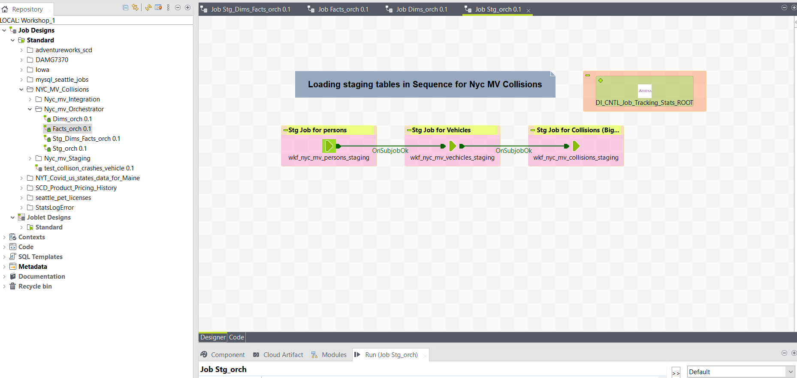
  </a>		
     
	Staging Data Workflows Orchestration (DI Control Jobs)

 

  
   
	<a href="#">
        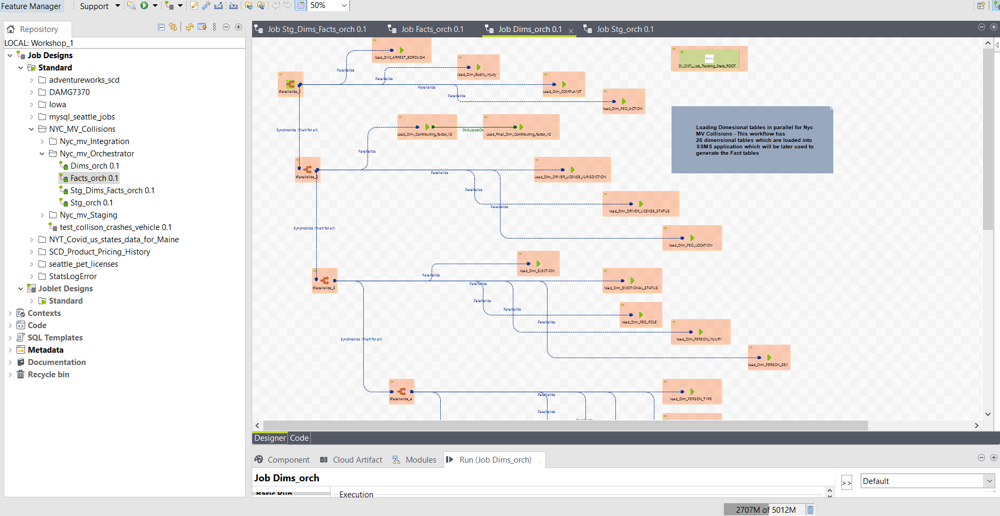
  </a>		
     
	Dimensional Data Workflows Orchestration (DI Control Jobs)

 

  
   
	<a href="#">
        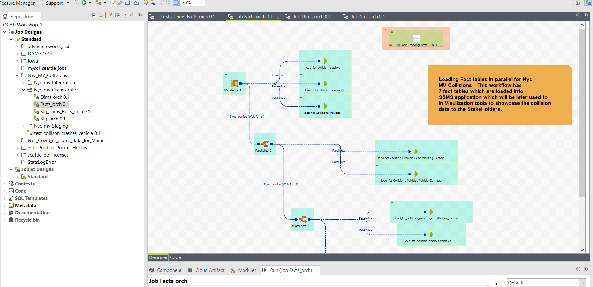
  </a>		
     
	Fact Data Workflows Orchestration (DI Control Jobs)

 

  
   
	<a href="#">
        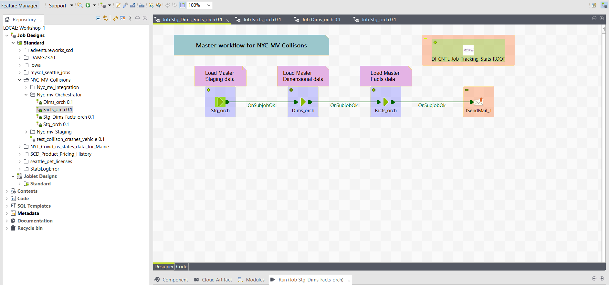
  </a>		
     
	Orchestration (DI Control Jobs) workflow of New York Motor Vehicle Collisions

 

## BI Reporting

BI reporting—preparing, analyzing, and portraying business metrics is fundamental to every business. The goal of BI reporting is to provide data insights to support decision making. This project leverages the potential of Tableau to derive key business insights by identifying key measurements such as Total Collisions by Geography and Time, Total Vehilces involved in Collisions, Fatalities KPIs The BI reports and dashboards developed as part of this project serves the purpose of identifying the accidents patterns and top contributing factors in those collisions. Some of the snapshots of the dashboards are attached below:

  
   
	<a href="#">
        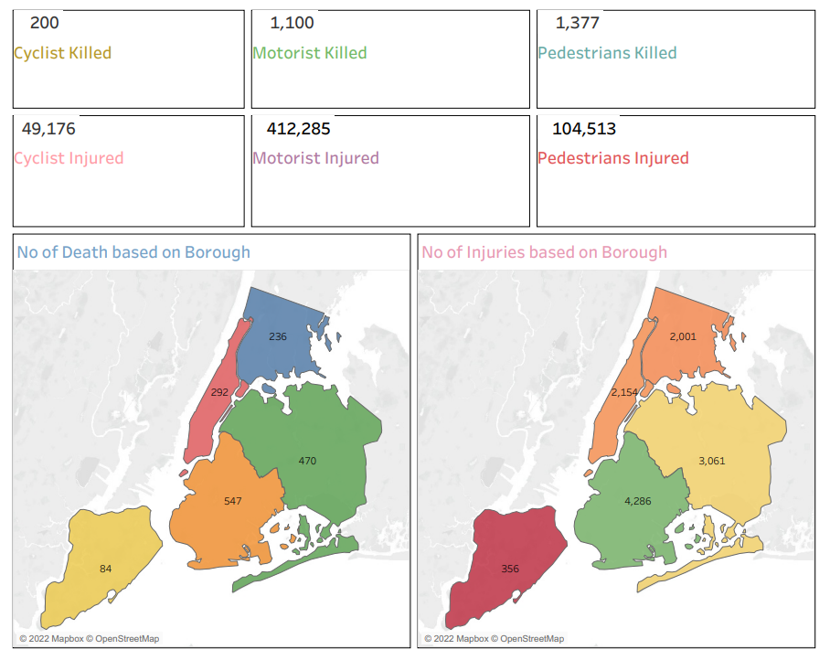
  </a>		
     
	New York Motor Vehicle Collisions Metrics Information

 

  
   
	<a href="#">
        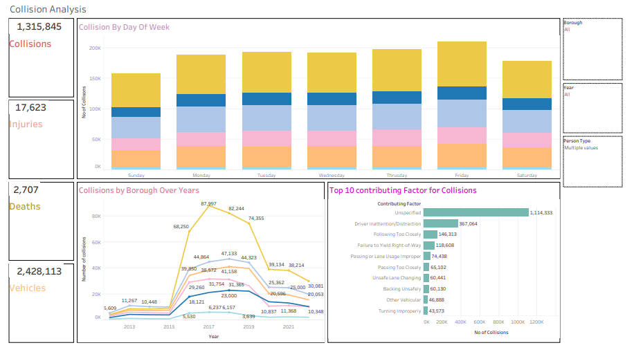
  </a>		
     
	New York Motor Vehicle Collisions analysis based Borough over years

 

  
   
	<a href="#">
        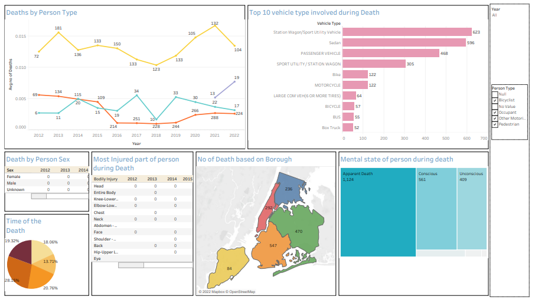
  </a>		
     
	New York Motor Vehicle Fatality data analysis

 

	
